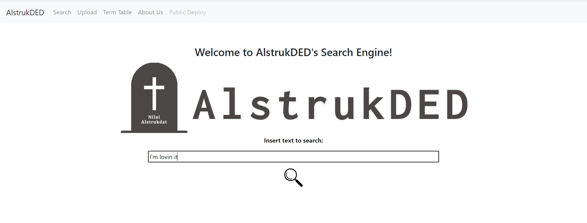
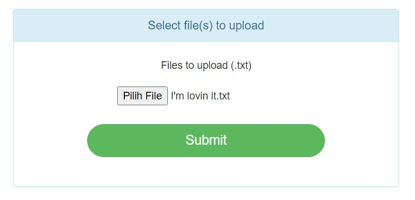
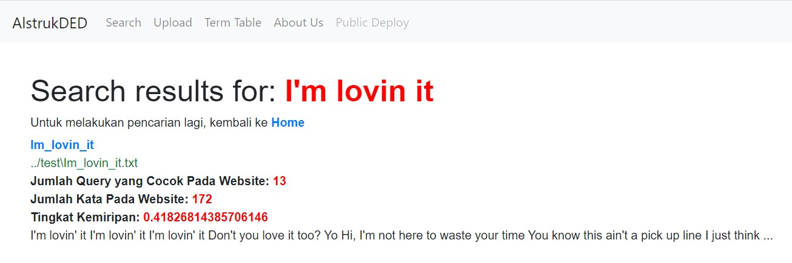

# Tubes 2 Aljabar Geometri
> by Alstrukded

## Table of contents
* [General info](#general-info)
* [Technologies](#technologies)
* [Setup](#setup)
* [Features](#features)
* [Status](#status)
* [Contact](#contact)

## General info
Project ini adalah Project membuat search engine yang menampilkan hasil berdasarkan persen similiaritas,
hasil pencarian yang persen similiaritasnya paling tinggi akan ditampilkan di paling awal hasil pencarian.
Project ini bisa mencari query dari file secara lokal, maupun dari web hasil dari webscraping

## Technologies
* Python - `version 3.8`

## Setup
### Instalasi Awal
* Pastikan python, sebaiknya python 3.8, sudah terinstall di komputer anda.
* Pastikan pip juga sudah terinstall di komputer anda.
* Jika belum maka download dan install terlebih dahulu python 3.8 dan pip, biasanya pip sudah preinstalled dengan python tapi bisa tidak. Kalau tidak, bisa didownload dan install sendiri.
* Install beberapa library ini dengan command berikut di terminal python:
1. `pip install sastrawi`
2. `pip install nltk`
3. `pip install flask`
4. `pip install numpy`
5. `pip install beautifulsoup4`
6. `pip install pandas`
7. `pip install glob2`
8. `pip install Werkzeug`
9. `pip install requests`
* Untuk menginstall nltk, jalankan program di python
```
>>>import nltk
>>>nltk.download()
```
Akan keluar window NLTK downloader, pilih download all.

### Menjalankan Program
* Import file dengan menggunakan `git clone https://github.com/girvinjunod/Algeo02-19096` di gitbash 
* Jalankan app.py dengan menggunakan command `python app.py` di command prompt.
* Copy atau ketik ulang link yang dikeluarkan ke dalam browser anda.`http://127.0.0.1:5000/`

### Search Engine Lokal 
* Untuk mencari file di local, dari menu utama tekan "File Lokal" kemudian masukkan query yang ingin dicari
* Untuk mengupload file dari lokal, bisa menekan tab "Upload" dan mengupload file dari komputer
* Term Table bisa diliat pada tab "Term Table"
* Untuk mencari lagi, klik tab search atau klik link home dari halaman search result

### Search Engine Web
* Untuk menggunakan pencarian web, dari menu utama tekan "WebScraping" dan memasukkan kategori juga query
* Term Table bisa diliat pada tab "Web Term Table"
* Untuk mencari lagi, klik tab search atau klik link home dari halaman search result

## Features
List of features ready and TODOs for future development
* Meng-upload file dari local files
* Mencari hasil pencarian paling relevan dari local files yang sudah diupload
* Mencari hasil pencarian paling relevan dari web yang ada
* Menunjukan persentase kemiripan semua file yang ada dengan query yang dicari

Screenshot:




## Status
Project is: _Finished_

## Contact
Created by AlstrukDED
